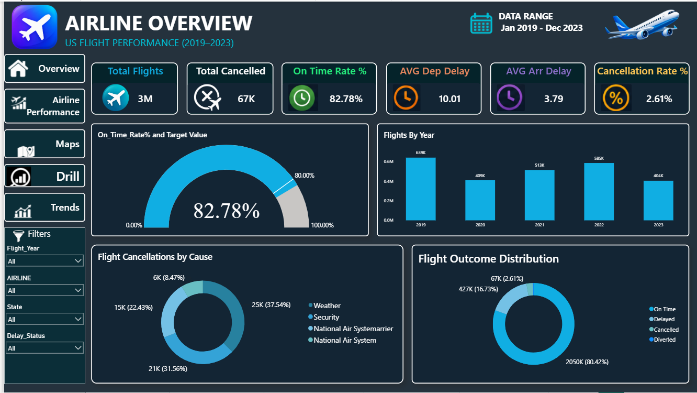
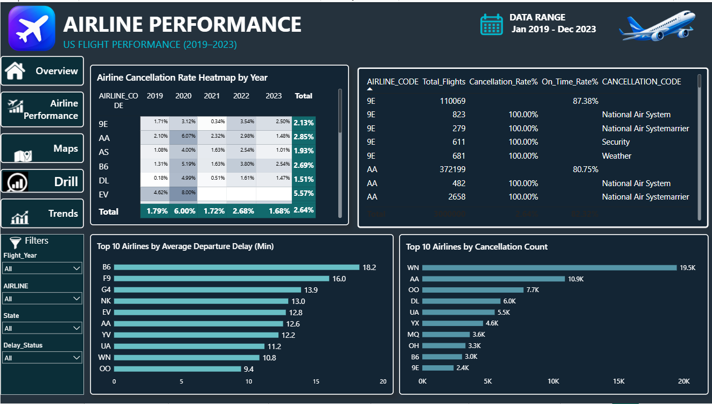
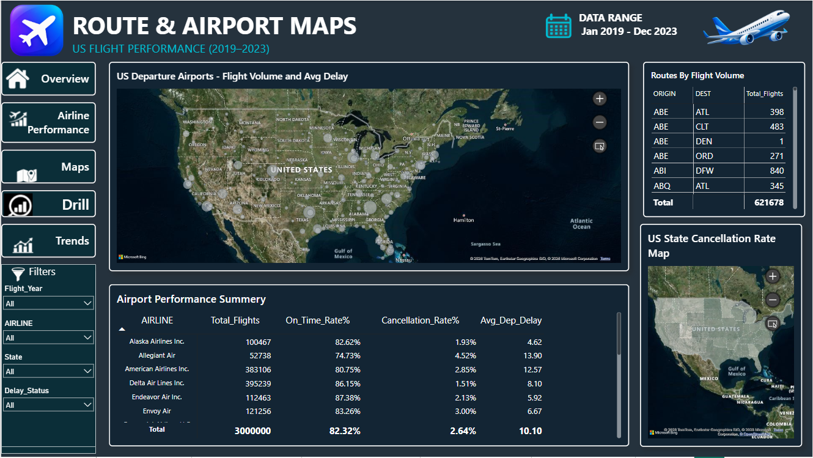
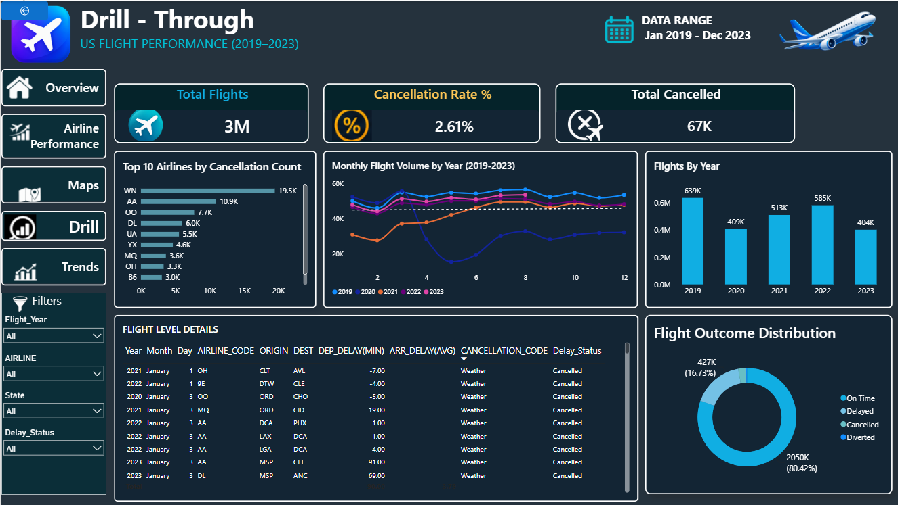
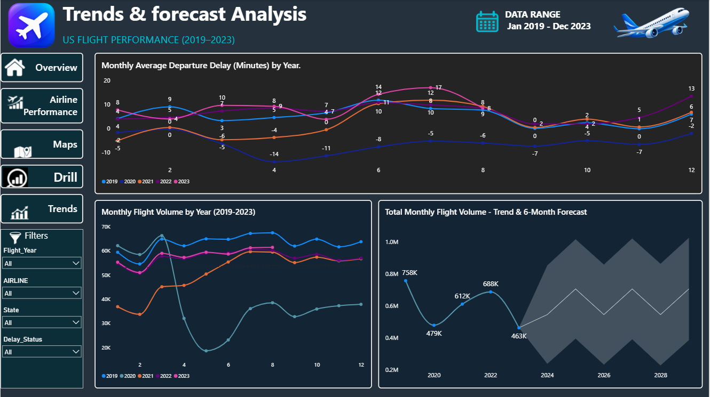
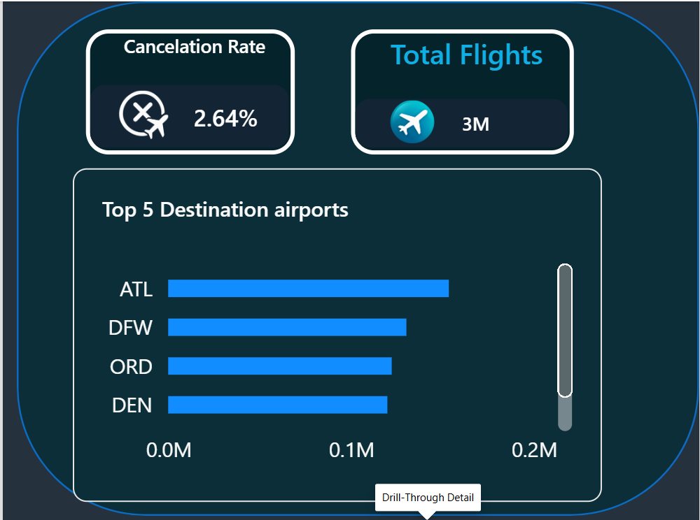

# ✈️ US Flight Performance Dashboard

An interactive **Power BI dashboard** designed to analyze **US flight performance from 2019 to 2023**.
The dashboard provides insights into flight volume, cancellations, delays, airline performance, airport routes, and flight trends.

---

## 📊 Dashboard Preview


### 🏠 Airline Overview



### ✈️ Airline Performance



### 🗺️ Route & Airport Maps



### 🔎 Drill-Through Analysis



### 📈 Trends & Forecast Analysis



### 🛫 Flight Summary



---

## 📌 Dashboard Pages

### 1. Airline Overview

Provides a high-level summary of flight operations using:

* Total Flights
* Total Cancelled Flights
* On-Time Rate
* Average Departure Delay
* Average Arrival Delay
* Cancellation Rate
* Flights by Year
* Flight Cancellation Causes
* Flight Outcome Distribution

### 2. Airline Performance

Analyzes airline-level performance using:

* Cancellation Rate Heatmap by Year
* Airline Performance Table
* Top 10 Airlines by Average Departure Delay
* Top 10 Airlines by Cancellation Count

### 3. Route & Airport Maps

Provides geographical insights into flight operations:

* US Departure Airport Flight Volume
* Average Airport Delay
* Route-wise Flight Volume
* Airport Performance Summary
* State-wise Cancellation Rate Map

### 4. Drill-Through Analysis

Provides detailed flight-level analysis with:

* Total Flights
* Cancellation Rate
* Total Cancelled
* Top Airlines by Cancellation Count
* Monthly Flight Volume
* Flights by Year
* Flight-Level Details
* Flight Outcome Distribution

### 5. Trends & Forecast Analysis

Analyzes historical and future flight trends:

* Monthly Average Departure Delay
* Monthly Flight Volume by Year
* Total Monthly Flight Volume
* 6-Month Forecast
* Interactive Filters

---

## 📈 Key Insights

* **3M+ total flights** are included in the analysis.
* Overall **On-Time Rate is above 80%**.
* Overall **Cancellation Rate is around 2.6%**.
* Flight volume varies significantly across different years.
* Weather and other operational factors contribute to flight cancellations.
* Airline performance differs in terms of delays and cancellation rates.
* Airport and route analysis helps identify high-volume flight corridors.
* Forecast analysis provides an estimate of future monthly flight volume.

---

## 🎛️ Interactive Features

* Year Filter
* Airline Filter
* State Filter
* Delay Status Filter
* Drill-Through Navigation
* Interactive Maps
* Tooltips
* Dynamic Charts
* Forecast Analysis
* Cross-filtering between visuals

---

## 🛠️ Tools & Technologies

* **Power BI Desktop**
* **Power Query**
* **DAX**
* **Microsoft Bing Maps**
* **Data Visualization**
* **Time Series Analysis**
* **Forecasting**

---

## 📂 Project Structure

```text
US-Flight-Performance-Dashboard/
│
├── README.md
├── US-Flight-Performance.pbix
│
├── dashboard-overview.png
├── airline-performance.png
├── route-airport-maps.png
├── drill-through.png
├── Trends-forecast.png
└── Tooltip.png
```

---

## 🎯 Business Objectives

The dashboard was developed to help analyze:

* Overall flight operational performance
* Airline reliability
* Flight cancellation patterns
* Departure and arrival delays
* Airport and route performance
* Yearly and monthly flight trends
* Future flight-volume patterns

---

## 👩‍💻 Author

**Sakshi Bagul**

Power BI | Data Analytics | Data Visualization

---

⭐ **If you find this project useful, feel free to star the repository!**
tory!**
